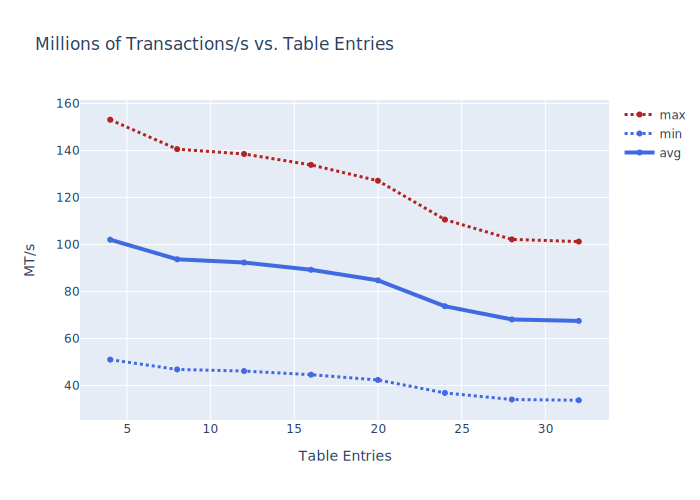

# Introduction

A novel implementation of a high-performance, matching engine for FPGA.

# Dependencies

The following external dependencies must be satisifed to run the project.

* Verilator (version >= 4.035)
* A compiler supporting C++17

# Instructions

# Performance

