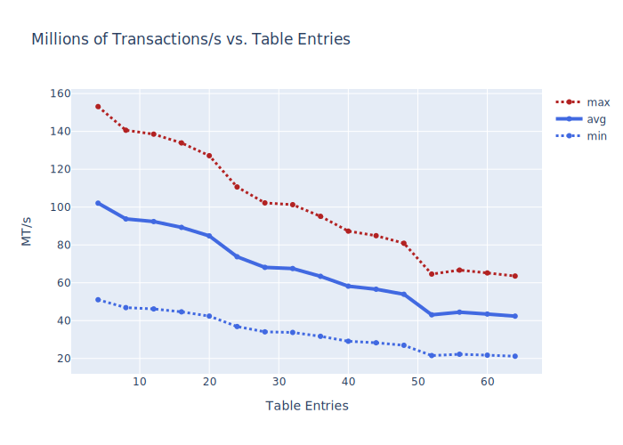

# Introduction

A novel implementation of a high-performance, matching engine for FPGA
is presented.

Financial institutions buy and sell publically traded shares on an
electronic market. A buyer places a Bid for a certain number of
stocks at a given price, and a seller places an Ask to sell a certain
number of stocks, also at a given price. When a buyer bids a value
greater than or equal to the price asked by a seller, a transaction
takes place. At any point in time, markets maintain the set of
outstanding buy and asks for a given stock in a entity known as an
Order Book (OB). An algorithm known as a Matching Engine (ME) is
reponsible for computing and emitting the set of trades that may take
place given an OB.

The financial industrial has recently focused on techniques and
approaches by which the operation performed by the Matching Engine can
be accelerated, as financial incentives exist to perform trades with
as smallest latency as possible. Consequently, in recent years, focus
has been paid to hardware (typically FPGA) implementations of many
common financial operations, as the ability to perform such operations
in the absence of software intervention (CPU) can result in a
substantial reduction in latency.

This project presents a high-performance Matching Engine
implementation for a fictious FPGA target, and demonstrates how a single
stock can be traded for a set of Bid-/Ask- transactions. On a
relatively modest, and low budget FPGA, this (relatively unoptimized)
implementation is capable of performing upto 40M trades per second,
when maintaining a set of upto 32 active Bids and 32 active Asks.

# Dependencies

The following external dependencies must be satisifed to run the project.

* Verilator (version >= 4.035)
* A compiler supporting C++17

# Basic build instructions

``` shell
# Clone project
git clone git@github.com:stephenry/ob.git
pushd ob
# Check out external dependencies
git submodule init
git submodule update
# Build project
mkdir build
pushd build
# Configure project
cmake ..
# Build project
cmake --build .
# Run regression using the CTEST driver (takes minutes)
ctest .
```

## Configuration

The Verilator configuration script located in
[FindVerilator.cmake](./cmake/FindVerilator.cmake) expects to discover
a Verilator installation at certain pre-defined paths. If Verilator
has not been installed at one of these known paths, it becomes
necessary to update the 'HINTS' field to point to the appropriate
location on your system.

# Build with VCD

``` shell
# Enable waveform dumping (slows simulation)
cmake -DOPT_VCD_ENABLE=ON ..
```

# Build with logging

``` shell
# Enable logging (slows simulation)
cmake -DOPT_LOGGING_ENABLE=ON ..
```

# Build an RTL configuratoin

For an RTL configuration with 16 entries both the Bid and Ask tables.

```shell
cmake -DBID_TABLE_N=16 -DASK_ENTRIES_N=16 ..
```

# Run a test

``` shell
# Run smoke test
./tb/test_tb_ob_smoke

# Run fully randomized regression
./tb/test_tb_ob_regress

# Run all registered tests
cmake .
```

# Performance

Timing figures of the RTL was carried out by running an initial
synthesis of the RTL. The achievable clock frequency directly
influences the rate at which commands may be executed by the
engine. The achievable clock frequency of the design is inversely
proportional to the table depth. As commands have variable latency, a
min/max range is presented demarcating the range of performance that
can be attained for a given table depth (measured in Transactions per
second). Synthesis was carried out targeting a relatively modest
xc7k70 FPGA, using Xilinx Vivado 2020.1.



# Discussion

The RTL solution consists as follows:

* Buy/Sell commands are issued to the match engine where they are
  placed in their respective tables. The entries of each table are
  ordered such that the maximum bid is at the head of the bid table,
  and the smallest ask is at the head of the ask table. A trade occurs
  when the current highest bidding order is equal to or greater than
  the smallest asking order.
* A key aspect of the design is in the implementation of the tables
  and, more specifically, the means by which entries can be added or
  removed from the table while maintaining a sorted order. A naive
  solution may be to insert/remove an entry from the table and then
  perform a sort operation using a traditional sort-network. This is
  sub-optimal. One must consider the time taken to perform a sort over
  some number of entries, which necessarily takes multiple cycles to
  be carried out. In addition, the complexity of the sorting network
  is proportional to the overall table depth, which could result in a
  frequency and logic overhead which could become a limiting factor in
  such a design.
* A key observation in the implementation of the proposed design is
  that only upto one entry may be added to or removed from a table at
  a particular time. As the table is sorted at the start of such
  operation, the re-sort operation can be carried out, essentially, in
  constant time by simply inserting a new element at the correct
  location, or removing an element and shifting the table. This can be
  carried out using a associatively addressed shift-register-like
  structure. The advantage of this approach is that sorting can be
  carried out in constant time, and the overall latency of the
  operation is unrelated to the table depth. The overall limiting
  factor in the design is that of the priority network used to select
  an appropriate location from the table, which is sub-linear on the
  table depth.
* A second observation is in the representation of the price
  state. Prices cannot be represented precisely using floating-point
  arithmetic. Floating point arithmetic also brings with it other
  complications such as logical complexity and
  timing-concerns. Instead, prices are represented using a 20b BCD
  format that can be trivially converted from ASCII. One need not
  perform BCD arithmetic when performing the table sort operation, as
  the BCD can be compared using standard twos-complement
  representation (conversion is unnecessary when simply comparing
  magnitudes).
* The major limiting aspect of the design is in the queue depth. Even
  using a relatively unoptimized flow, it is possible to achieve upto
  40M trades per second on a modest FPGA with 32 Bid/32 Ask table
  entries. This can be optimized further with some additional
  pipelining around the match logic, must this has not yet been
  implemented.

